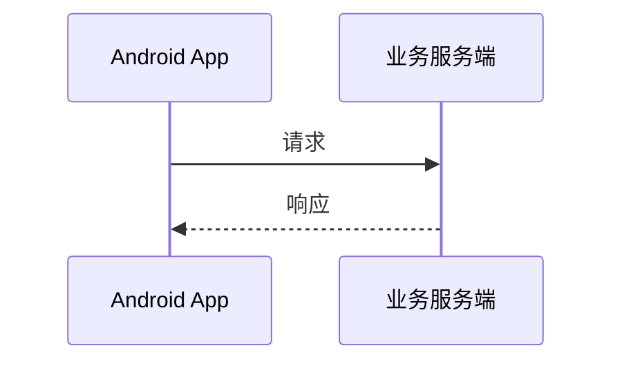

# Mermaid Lens

一个 Obsidian 插件，用一份全局配置渲染所有 Mermaid 图，并在可拖拽、可缩放的弹层中查看大图。

## 功能

- 全局 Mermaid JSON 配置，不必在每个代码块中写 `%%{init}%%`
- 默认内置紫色 sequenceDiagram 主题和 `sequence.useMaxWidth: true`
- 配置深度合并：插件配置覆盖 Obsidian 的同名 Mermaid 配置
- 单击、双击或展开按钮打开大图（默认双击）
- 拖拽平移、光标中心滚轮缩放、移动端双指缩放、双击适配窗口
- 图表始终限制在笔记宽度内

## 构建与安装

```bash
npm install
npm test
npm run test:coverage
npm run build
```

构建产物会生成在 `dist/` 目录。将其中三个文件复制到 Vault：

```text
<Vault>/.obsidian/plugins/mermaid-lens/
├── main.js       # dist/main.js
├── manifest.json # dist/manifest.json
└── styles.css    # dist/styles.css
```

然后在 Obsidian 的“设置 → 第三方插件”中重新加载并启用 **Mermaid Lens**。

## 在真实 Obsidian 中测试

项目可以在根目录创建一个被 Git 忽略的 `ObsidianTestVault/`。运行：

```bash
npm run deploy
```

该命令会先构建插件，然后：

- 将插件部署到 `ObsidianTestVault/.obsidian/plugins/mermaid-lens/`
- 将多维度验收笔记复制到 `ObsidianTestVault/Mermaid Lens Tests/`
- 自动创建并注册尚不存在的本地测试 Vault
- 通过 Obsidian URI 启动 Obsidian、切换到该 Vault 并打开验收清单

无论 Obsidian 尚未启动、已打开其他 Vault，还是已经打开测试 Vault，都使用同一个命令。启用插件后，从 `00-验收清单.md` 开始检查。测试笔记包含简单、中等复杂度和大型图表，覆盖流程图、时序图、状态图、类图、ER 图、链接、重复 SVG ID 和超宽图表。

也可以部署到任意现有测试 Vault：

```bash
npm run deploy -- --vault "C:\\path\\to\\vault"
```

如不希望复制验收笔记：

```bash
npm run deploy -- --vault "C:\\path\\to\\vault" --no-notes
```

如只部署、不打开 Obsidian：

```bash
npm run deploy -- --no-open
```

每次修改代码后重新运行部署命令，再在 Obsidian 中禁用并重新启用插件。可按 `Ctrl+Shift+I` 打开开发者工具检查 Console。

## 使用

启用后 Mermaid 代码只需保留图表正文：

````markdown

````

在“设置 → Mermaid Lens”中可以编辑完整 Mermaid 配置。修改后点击“应用并重绘”。配置格式是 JSON 对象，例如：

```json
{
  "theme": "base",
  "themeVariables": {
    "primaryColor": "#EEF2FF"
  },
  "sequence": {
    "useMaxWidth": true,
    "actorMargin": 40
  }
}
```

## 实现说明

- 设置页中的 JSON 是草稿，只有验证并成功应用后才会持久化。
- 图表节点通过弱引用登记，不会保留已经被 Obsidian 销毁的预览 DOM。
- 查看器会等待 Modal 完成布局，并在尺寸变化时重新适配。
- 克隆到查看器中的 SVG 会重写内部 ID，避免 marker、filter 和 gradient 与原图冲突。

## 注意

插件会以可卸载的透明包装器扩展 Obsidian 提供的全局 Mermaid `initialize()`。如果同时启用其他修改 Mermaid 初始化过程的插件，配置优先级仍可能受插件加载顺序影响，建议不要同时启用同类主题插件。
