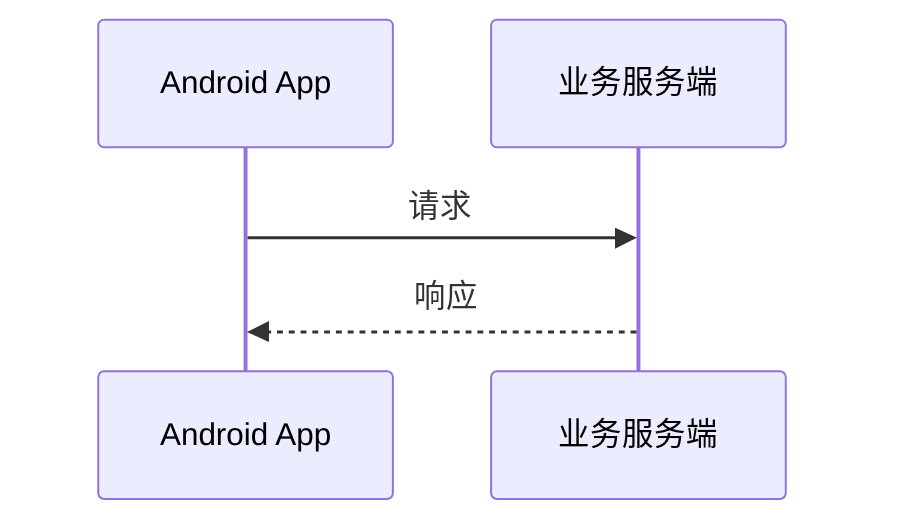

# Mermaid Lens

一个 Obsidian 插件，用一份全局配置渲染所有 Mermaid 图，并在可拖拽、可缩放的弹层中查看大图。

## 功能

- 全局 Mermaid JSON 配置，不必在每个代码块中写 `%%{init}%%`
- 默认内置紫色 sequenceDiagram 主题和 `sequence.useMaxWidth: true`
- 配置深度合并：插件配置覆盖 Obsidian 的同名 Mermaid 配置
- 单击、双击或展开按钮打开大图（默认双击）
- 拖拽平移、光标中心滚轮缩放、移动端双指缩放、双击适配窗口
- 图表始终限制在笔记宽度内

## 构建与安装

```bash
npm install
npm test
npm run build
```

将下面三个文件复制到 Vault：

```text
<Vault>/.obsidian/plugins/mermaid-lens/
├── main.js
├── manifest.json
└── styles.css
```

然后在 Obsidian 的“设置 → 第三方插件”中重新加载并启用 **Mermaid Lens**。

## 使用

启用后 Mermaid 代码只需保留图表正文：

````markdown

````

在“设置 → Mermaid Lens”中可以编辑完整 Mermaid 配置。修改后点击“应用并重绘”。配置格式是 JSON 对象，例如：

```json
{
  "theme": "base",
  "themeVariables": {
    "primaryColor": "#EEF2FF"
  },
  "sequence": {
    "useMaxWidth": true,
    "actorMargin": 40
  }
}
```

## 实现说明

- 设置页中的 JSON 是草稿，只有验证并成功应用后才会持久化。
- 图表节点通过弱引用登记，不会保留已经被 Obsidian 销毁的预览 DOM。
- 查看器会等待 Modal 完成布局，并在尺寸变化时重新适配。
- 克隆到查看器中的 SVG 会重写内部 ID，避免 marker、filter 和 gradient 与原图冲突。

## 注意

插件会以可卸载的透明包装器扩展 Obsidian 提供的全局 Mermaid `initialize()`。如果同时启用其他修改 Mermaid 初始化过程的插件，配置优先级仍可能受插件加载顺序影响，建议不要同时启用同类主题插件。
