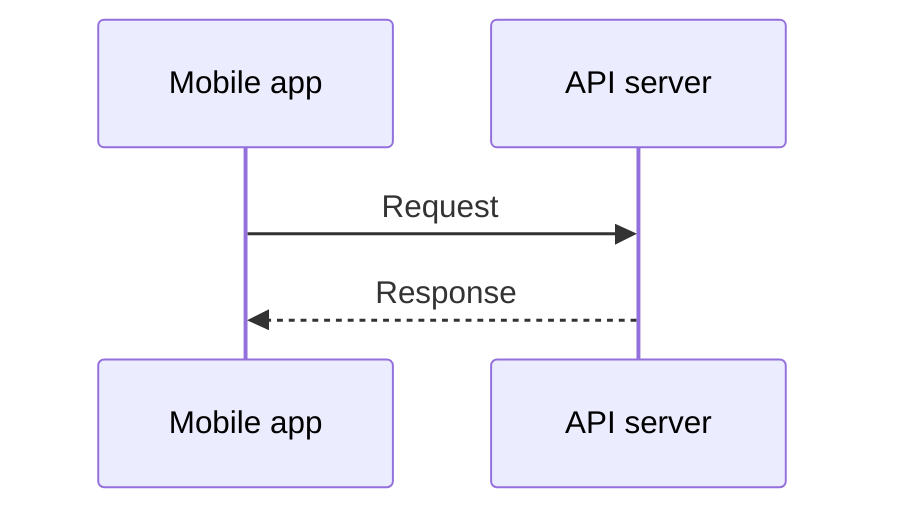

# Mermaid Lens

Mermaid Lens is an Obsidian plugin that applies one shared Mermaid configuration across your vault and opens diagrams in a dedicated pan-and-zoom viewer.

[简体中文](README.zh-CN.md)

| Zoomed out | Zoomed in |
| --- | --- |
|  |  |

https://github.com/user-attachments/assets/056c7e1b-5d88-4508-99bb-ded31a615efd

## Features

- Apply one Mermaid theme, color palette, font, spacing, and layout configuration throughout your vault.
- Open large or complex diagrams in a viewer unconstrained by the note width.
- Pan by dragging and zoom with the mouse wheel, toolbar, keyboard, or touch gestures.
- Choose single-click, double-click, or expand-button activation.
- Follow links and use buttons inside diagrams without accidentally opening the viewer.
- Validate new Mermaid configuration before saving it and retain the previous valid configuration if applying or saving fails.
- Preserve the natural size of small diagrams while constraining large diagrams to the note width.

## Installation

Mermaid Lens requires Obsidian 1.12.0 or later.

### Community plugins

1. Open **Settings → Community plugins** and turn off Restricted mode if necessary.
2. Select **Browse** and search for **Mermaid Lens**.
3. Install and enable the plugin.

### Manual installation

1. Download `main.js`, `manifest.json`, and `styles.css` from [GitHub Releases](https://github.com/aitsuki/obsidian-mermaid-lens/releases).
2. Place all three files in:

   ```text
   <Vault>/.obsidian/plugins/mermaid-lens/
   ```

3. Reload Obsidian, then enable **Mermaid Lens** under **Settings → Community plugins**.

## Usage

### Create a Mermaid diagram

The plugin uses Obsidian's standard Mermaid syntax:

````markdown

````

### Open the viewer

By default, click a Mermaid diagram to open it. You can change the trigger under **Settings → Mermaid Lens** to double-click or the expand button only.

Viewer controls:

| Input | Action |
| --- | --- |
| Drag with the primary mouse button | Pan |
| Mouse wheel | Zoom around the pointer |
| `+`, `=`, or `-` | Zoom in or out |
| Double-click | Fit the diagram to the viewer |
| Toolbar buttons | Zoom out, fit, or zoom in |
| Escape | Close the viewer |
| One- or two-finger touch gesture | Pan or pinch to zoom |

### Configure diagram appearance

Open **Settings → Mermaid Lens**, edit **Global Mermaid configuration**, and select **Apply and redraw**. The value must be a JSON object accepted by Mermaid's `initialize()` API. For example:

```json
{
  "theme": "base",
  "themeVariables": {
    "primaryColor": "#EEF2FF",
    "primaryBorderColor": "#6366F1",
    "primaryTextColor": "#1E293B",
    "lineColor": "#64748B"
  },
  "sequence": {
    "actorMargin": 40,
    "messageMargin": 30
  }
}
```

See the [Mermaid configuration reference](https://mermaid.js.org/config/schema-docs/config.html) for available fields. Changes remain a draft until you select **Apply and redraw**. Use **Restore defaults** to return to the bundled configuration.

## Compatibility

- Requires Obsidian 1.12.0 or later.
- Supports desktop and mobile.
- Mermaid Lens modifies Obsidian's shared Mermaid configuration. Other plugins that initialize Mermaid may override it depending on plugin load order.

## Development and contributing

See [CONTRIBUTING.md](CONTRIBUTING.md) for build, test, and acceptance-testing instructions.
