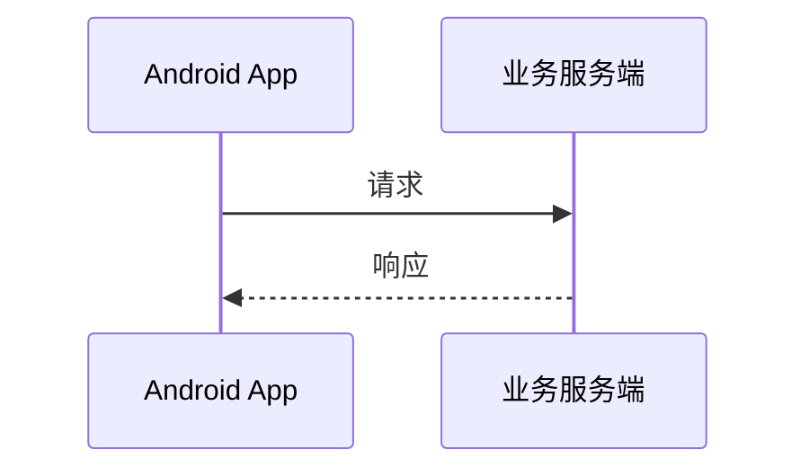

# Mermaid Lens

Mermaid Lens 是一个 Obsidian 插件，用于统一设置笔记中的 Mermaid 图表，并在独立查看器中浏览尺寸较大或内容复杂的图表。

| zoom out | zoom in |
| --- | ---|
|  |  |

https://github.com/user-attachments/assets/056c7e1b-5d88-4508-99bb-ded31a615efd


## 主要功能

- **统一图表外观**：在插件设置中集中调整 Mermaid 的主题、颜色、字体、间距和布局参数，配置会应用到整个 Vault 中的 Mermaid 图表。
- **大图查看器**：在弹窗中查看图表，不受笔记正文宽度限制。
- **平移与缩放**：支持鼠标拖拽、以光标为中心的滚轮缩放、工具栏缩放、双击适配窗口，以及移动设备上的单指平移和双指缩放。
- **多种打开方式**：可以选择单击、双击或右上角展开按钮；默认使用单击。
- **兼容图中链接**：点击图表内的链接或按钮时，不会误触发查看器。
- **安全应用配置**：新配置只有在 JSON 格式正确且 Mermaid 成功接受后才会保存；应用或保存失败时会继续使用上一份有效配置。
- **自适应笔记宽度**：小图保持自然尺寸，大图不会撑破笔记布局。

## 安装

目前可以从源码构建插件：

```bash
npm install
npm run build
```

构建完成后，将 `dist/` 中的三个文件复制到 Vault 的插件目录：

```text
<Vault>/.obsidian/plugins/mermaid-lens/
├── main.js
├── manifest.json
└── styles.css
```

然后打开 Obsidian：

1. 进入“设置 → 第三方插件”。
2. 重新加载已安装插件。
3. 启用 **Mermaid Lens**。

## 使用

### 创建 Mermaid 图表

插件不改变 Obsidian 原有的 Mermaid 语法。例如：

````markdown

````

### 打开大图

默认情况下，单击图表即可打开查看器。也可以在“设置 → Mermaid Lens”中改为：

- 双击图表
- 仅使用图表右上角的展开按钮

查看器中的操作：

| 操作 | 效果 |
| --- | --- |
| 鼠标左键拖拽 | 平移图表 |
| 鼠标滚轮 | 以光标位置为中心缩放 |
| `+`、`=`、`-` | 放大或缩小 |
| 双击查看器 | 重新适配窗口 |
| 工具栏按钮 | 缩小、适配窗口、放大 |
| Esc | 关闭查看器 |
| 移动设备单指/双指 | 平移或缩放 |

### 配置图表外观

进入“设置 → Mermaid Lens”，编辑“全局 Mermaid 配置”，然后点击“应用并重绘”。配置使用 JSON 格式，字段由 Mermaid 定义。例如：

```json
{
  "theme": "base",
  "themeVariables": {
    "primaryColor": "#EEF2FF",
    "primaryBorderColor": "#6366F1",
    "primaryTextColor": "#1E293B",
    "lineColor": "#64748B"
  },
  "sequence": {
    "actorMargin": 40,
    "messageMargin": 30
  }
}
```

这份配置表示：使用 Mermaid 的 `base` 主题，自定义图表颜色，并调整时序图中参与者和消息之间的间距。更多字段可参考 [Mermaid 配置文档](https://mermaid.js.org/config/schema-docs/config.html)。

编辑框中的内容只是草稿。只有点击“应用并重绘”且配置通过验证后，插件才会保存并重绘当前打开的 Mermaid 图表。“恢复默认配置”可以随时恢复插件自带的初始设置。

## 开发

### 常用命令

```bash
npm install
npm test
npm run test:coverage
npm run build
```

- `npm test`：运行单元测试和 DOM 行为测试。
- `npm run test:coverage`：运行测试并检查覆盖率门槛。
- `npm run build`：执行 TypeScript 检查并生成 `dist/` 构建产物。

### 在真实 Obsidian 中验收

项目提供了本地测试 Vault 和多维度验收笔记。运行：

```bash
npm run deploy
```

该命令会：

1. 构建插件。
2. 创建被 Git 忽略的 `ObsidianTestVault/`。
3. 将插件部署到 `ObsidianTestVault/.obsidian/plugins/mermaid-lens/`。
4. 将验收笔记复制到 `ObsidianTestVault/Mermaid Lens Tests/`。
5. 注册测试 Vault，并通过 Obsidian URI 打开 Vault 和验收清单。

验收笔记包含简单、中等复杂度和大型图表，覆盖流程图、时序图、状态图、类图、ER 图、图中链接、重复 SVG ID 和超宽图表。

部署到其他测试 Vault：

```bash
npm run deploy -- --vault "C:\path\to\vault"
```

不复制验收笔记：

```bash
npm run deploy -- --vault "C:\path\to\vault" --no-notes
```

只部署，不打开 Obsidian：

```bash
npm run deploy -- --no-open
```

修改代码后需要重新部署，并在 Obsidian 中重新加载或禁用后再次启用插件。可以按 `Ctrl+Shift+I` 打开开发者工具检查 Console。

## 实现概览

- 插件在 Obsidian 加载 Mermaid 时合并全局配置，并在卸载时恢复原始配置。
- 图表通过 DOM 变化监听自动登记，因此渲染耗时较长的图表也能获得查看器入口。
- 查看器会等待弹窗完成布局，并在窗口尺寸变化时重新计算适配状态。
- 查看器中的 SVG 克隆会重写内部 ID，避免 marker、filter 和 gradient 与笔记中的原图冲突。
- 应用配置时会保留编辑器的光标和滚动位置，并仅重绘包含 Mermaid 的 Markdown 视图。

## 兼容性说明

Mermaid Lens 会调整 Obsidian 使用的共享 Mermaid 配置。如果同时启用其他会修改 Mermaid 主题或初始化配置的插件，最终效果可能受插件加载顺序影响。建议避免同时启用功能重叠的 Mermaid 配置插件。
