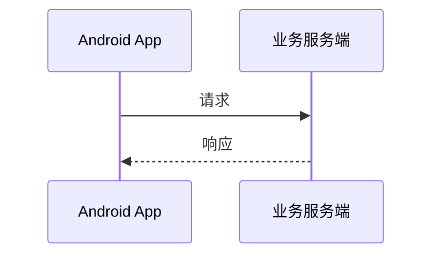

# Mermaid Lens

[English](README.md)

Mermaid Lens 是一个 Obsidian 插件，用于统一设置笔记中的 Mermaid 图表，并在独立查看器中浏览尺寸较大或内容复杂的图表。

| zoom out | zoom in |
| --- | ---|
|  |  |

https://github.com/user-attachments/assets/056c7e1b-5d88-4508-99bb-ded31a615efd


## 主要功能

- **统一图表外观**：在插件设置中集中调整 Mermaid 的主题、颜色、字体、间距和布局参数，配置会应用到整个 Vault 中的 Mermaid 图表。
- **大图查看器**：在弹窗中查看图表，不受笔记正文宽度限制。
- **平移与缩放**：支持鼠标拖拽、以光标为中心的滚轮缩放、工具栏缩放、双击适配窗口，以及移动设备上的单指平移和双指缩放。
- **多种打开方式**：可以选择单击、双击或右上角展开按钮；默认使用单击。
- **兼容图中链接**：点击图表内的链接或按钮时，不会误触发查看器。
- **安全应用配置**：新配置只有在 JSON 格式正确且 Mermaid 成功接受后才会保存；应用或保存失败时会继续使用上一份有效配置。
- **自适应笔记宽度**：小图保持自然尺寸，大图不会撑破笔记布局。

## 安装

需要 Obsidian 1.12.0 或更高版本。

### 社区插件市场

1. 打开“设置 → 第三方插件”，关闭受限模式。
2. 选择“浏览”，搜索 **Mermaid Lens**。
3. 安装并启用插件。

### 手动安装

1. 从 [GitHub Releases](https://github.com/aitsuki/obsidian-mermaid-lens/releases) 下载 `main.js`、`manifest.json` 和 `styles.css`。
2. 将三个文件放入以下目录：

   ```text
   <Vault>/.obsidian/plugins/mermaid-lens/
   ```

3. 重新加载 Obsidian，然后在“设置 → 第三方插件”中启用 **Mermaid Lens**。

## 使用

### 创建 Mermaid 图表

插件不改变 Obsidian 原有的 Mermaid 语法。例如：

````markdown

````

### 打开大图

默认情况下，单击图表即可打开查看器。也可以在“设置 → Mermaid Lens”中改为：

- 双击图表
- 仅使用图表右上角的展开按钮

查看器中的操作：

| 操作 | 效果 |
| --- | --- |
| 鼠标左键拖拽 | 平移图表 |
| 鼠标滚轮 | 以光标位置为中心缩放 |
| `+`、`=`、`-` | 放大或缩小 |
| 双击查看器 | 重新适配窗口 |
| 工具栏按钮 | 缩小、适配窗口、放大 |
| Esc | 关闭查看器 |
| 移动设备单指/双指 | 平移或缩放 |

### 配置图表外观

进入“设置 → Mermaid Lens”，编辑“全局 Mermaid 配置”，然后点击“应用并重绘”。配置使用 JSON 格式，字段由 Mermaid 定义。例如：

```json
{
  "theme": "base",
  "themeVariables": {
    "primaryColor": "#EEF2FF",
    "primaryBorderColor": "#6366F1",
    "primaryTextColor": "#1E293B",
    "lineColor": "#64748B"
  },
  "sequence": {
    "actorMargin": 40,
    "messageMargin": 30
  }
}
```

这份配置表示：使用 Mermaid 的 `base` 主题，自定义图表颜色，并调整时序图中参与者和消息之间的间距。更多字段可参考 [Mermaid 配置文档](https://mermaid.js.org/config/schema-docs/config.html)。

编辑框中的内容只是草稿。只有点击“应用并重绘”且配置通过验证后，插件才会保存并重绘当前打开的 Mermaid 图表。“恢复默认配置”可以随时恢复插件自带的初始设置。

## 开发与贡献

源码构建、测试和验收流程请参阅 [CONTRIBUTING.md](CONTRIBUTING.md)。

## 兼容性说明

- 最低支持 Obsidian 1.12.0。
- 支持桌面端和移动端。

Mermaid Lens 会调整 Obsidian 使用的共享 Mermaid 配置。如果同时启用其他会修改 Mermaid 主题或初始化配置的插件，最终效果可能受插件加载顺序影响。建议避免同时启用功能重叠的 Mermaid 配置插件。
