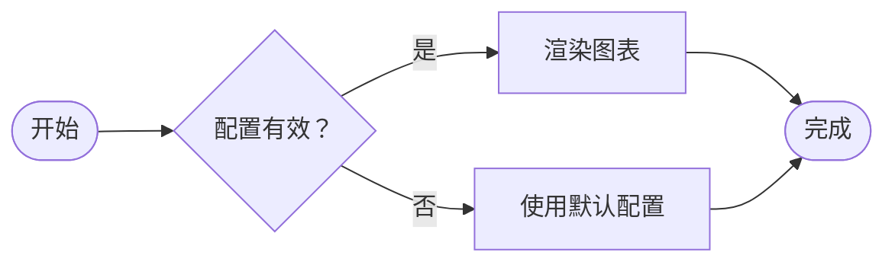
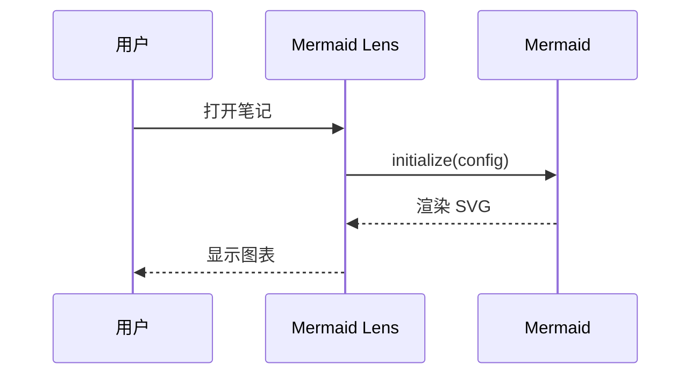
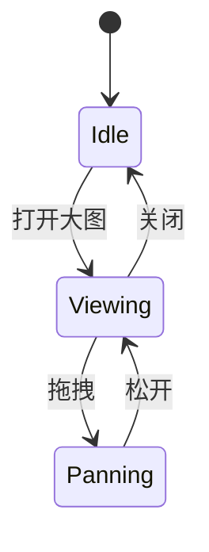
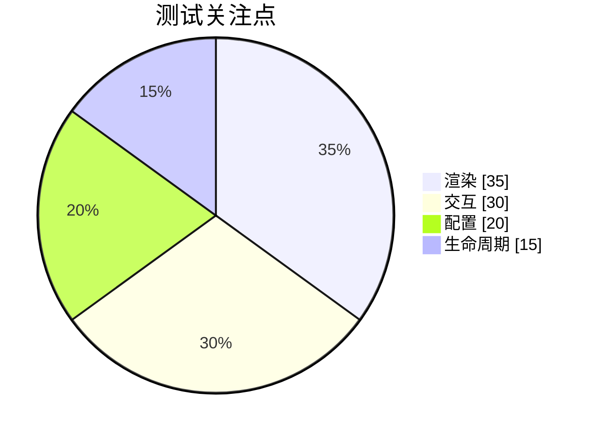
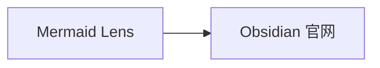
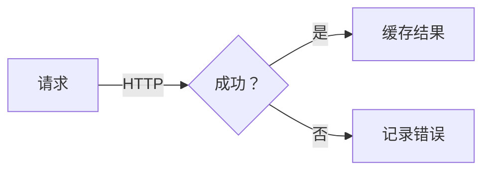

# 简单图表

这些图表用于快速确认基本渲染、展开按钮和 Viewer 操作。

## 简单流程图

```mermaid
flowchart LR
    Start([开始]) --> Check{配置有效？}
    Check -- 是 --> Render[渲染图表]
    Check -- 否 --> Fallback[使用默认配置]
    Render --> Done([完成])
    Fallback --> Done
```

## 简单时序图

```mermaid
sequenceDiagram
    participant User as 用户
    participant Plugin as Mermaid Lens
    participant Mermaid as Mermaid
    User->>Plugin: 打开笔记
    Plugin->>Mermaid: initialize(config)
    Mermaid-->>Plugin: 渲染 SVG
    Plugin-->>User: 显示图表
```

## 状态图

```mermaid
stateDiagram-v2
    [*] --> Idle
    Idle --> Viewing: 打开大图
    Viewing --> Panning: 拖拽
    Panning --> Viewing: 松开
    Viewing --> Idle: 关闭
```

## 饼图

```mermaid
pie showData
    title 测试关注点
    "渲染" : 35
    "交互" : 30
    "配置" : 20
    "生命周期" : 15
```

## 带链接的图表

点击“Obsidian 官网”应打开链接，而不应误触 Viewer。

```mermaid
flowchart LR
    Plugin[Mermaid Lens] --> Site[Obsidian 官网]
    click Site "https://obsidian.md" "打开 Obsidian 官网"
```

## 重复 SVG ID 压力样本 A

```mermaid
flowchart LR
    A[请求] -->|HTTP| B{成功？}
    B -->|是| C[缓存结果]
    B -->|否| D[记录错误]
```

## 重复 SVG ID 压力样本 B

```mermaid
flowchart LR
    A[请求] -->|HTTP| B{成功？}
    B -->|是| C[缓存结果]
    B -->|否| D[记录错误]
```
