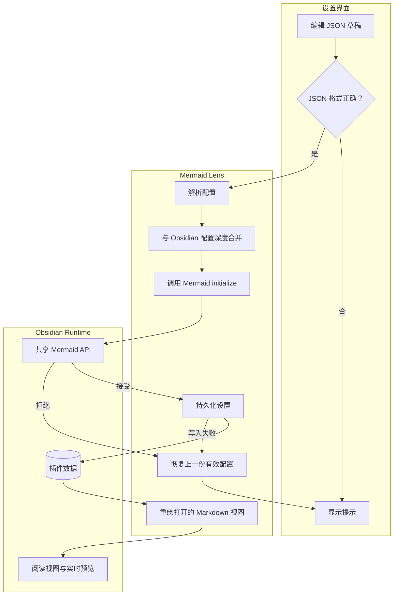
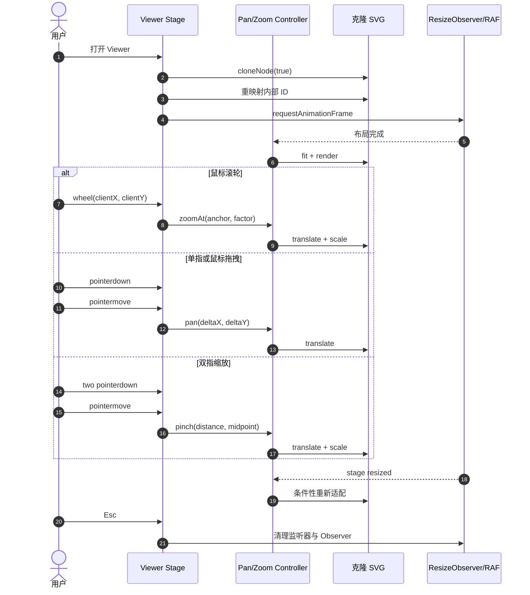
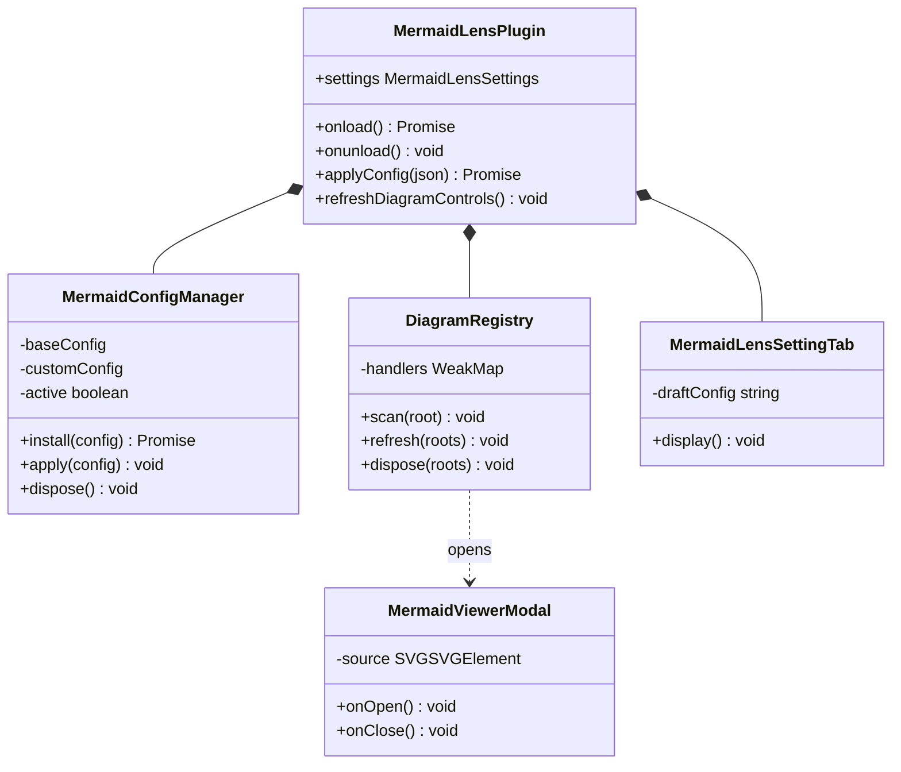
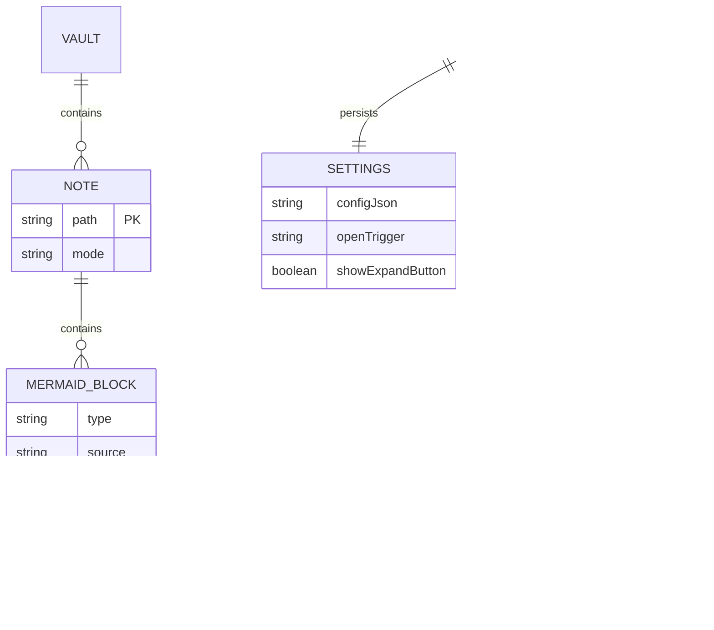

# 中等复杂度图表

用于检查多种 Mermaid 图、较长文本、子图、关系线和 Viewer 中等规模交互。

## 插件配置应用流程

```mermaid
flowchart TB
    subgraph UI[设置界面]
        Edit[编辑 JSON 草稿]
        Validate{JSON 格式正确？}
        Notice[显示提示]
    end

    subgraph Plugin[Mermaid Lens]
        Parse[解析配置]
        Merge[与 Obsidian 配置深度合并]
        Apply[调用 Mermaid initialize]
        Save[持久化设置]
        Rollback[恢复上一份有效配置]
        Rerender[重绘打开的 Markdown 视图]
    end

    subgraph Obsidian[Obsidian Runtime]
        Mermaid[共享 Mermaid API]
        Views[阅读视图与实时预览]
        Storage[(插件数据)]
    end

    Edit --> Validate
    Validate -- 否 --> Notice
    Validate -- 是 --> Parse --> Merge --> Apply
    Apply --> Mermaid
    Mermaid -- 接受 --> Save --> Storage
    Storage --> Rerender --> Views
    Mermaid -- 拒绝 --> Rollback --> Notice
    Save -- 写入失败 --> Rollback
```

## Viewer 手势时序

```mermaid
sequenceDiagram
    autonumber
    actor User as 用户
    participant Stage as Viewer Stage
    participant Controller as Pan/Zoom Controller
    participant SVG as 克隆 SVG
    participant Browser as ResizeObserver/RAF

    User->>Stage: 打开 Viewer
    Stage->>SVG: cloneNode(true)
    Stage->>SVG: 重映射内部 ID
    Stage->>Browser: requestAnimationFrame
    Browser-->>Controller: 布局完成
    Controller->>SVG: fit + render

    alt 鼠标滚轮
        User->>Stage: wheel(clientX, clientY)
        Stage->>Controller: zoomAt(anchor, factor)
        Controller->>SVG: translate + scale
    else 单指或鼠标拖拽
        User->>Stage: pointerdown
        User->>Stage: pointermove
        Stage->>Controller: pan(deltaX, deltaY)
        Controller->>SVG: translate
    else 双指缩放
        User->>Stage: two pointerdown
        User->>Stage: pointermove
        Stage->>Controller: pinch(distance, midpoint)
        Controller->>SVG: translate + scale
    end

    Browser-->>Controller: stage resized
    Controller->>SVG: 条件性重新适配
    User->>Stage: Esc
    Stage->>Browser: 清理监听器与 Observer
```

## 类关系

```mermaid
classDiagram
    class MermaidLensPlugin {
        +settings MermaidLensSettings
        +onload() Promise
        +onunload() void
        +applyConfig(json) Promise
        +refreshDiagramControls() void
    }
    class MermaidConfigManager {
        -baseConfig
        -customConfig
        -active boolean
        +install(config) Promise
        +apply(config) void
        +dispose() void
    }
    class DiagramRegistry {
        -handlers WeakMap
        +scan(root) void
        +refresh(roots) void
        +dispose(roots) void
    }
    class MermaidViewerModal {
        -source SVGSVGElement
        +onOpen() void
        +onClose() void
    }
    class MermaidLensSettingTab {
        -draftConfig string
        +display() void
    }

    MermaidLensPlugin *-- MermaidConfigManager
    MermaidLensPlugin *-- DiagramRegistry
    MermaidLensPlugin *-- MermaidLensSettingTab
    DiagramRegistry ..> MermaidViewerModal : opens
```

## 数据关系

```mermaid
erDiagram
    VAULT ||--o{ NOTE : contains
    NOTE ||--o{ MERMAID_BLOCK : contains
    MERMAID_BLOCK ||--|| SVG : renders
    PLUGIN ||--|| SETTINGS : persists
    PLUGIN ||--o{ DIAGRAM_HOST : registers
    DIAGRAM_HOST ||--o| VIEWER : opens

    NOTE {
        string path PK
        string mode
    }
    MERMAID_BLOCK {
        string type
        string source
    }
    SETTINGS {
        string configJson
        string openTrigger
        boolean showExpandButton
    }
```
