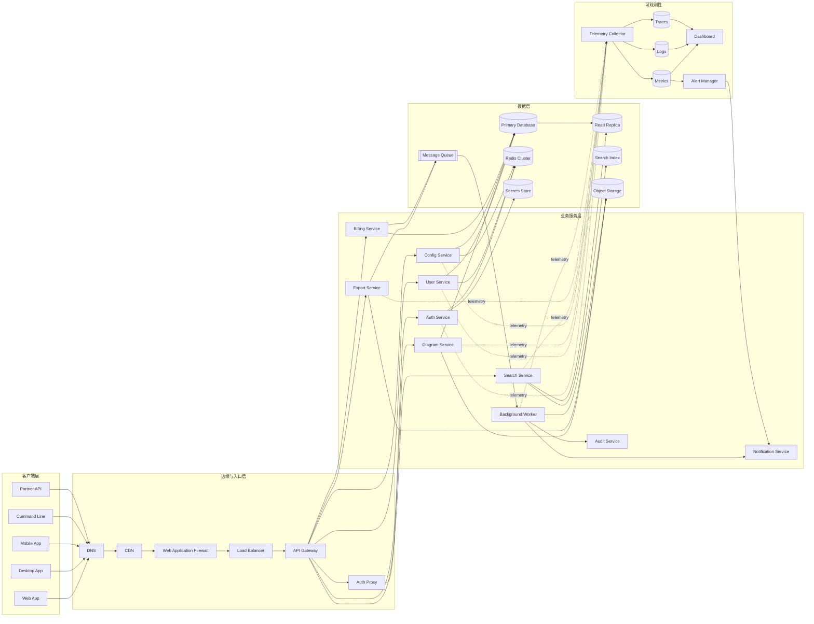
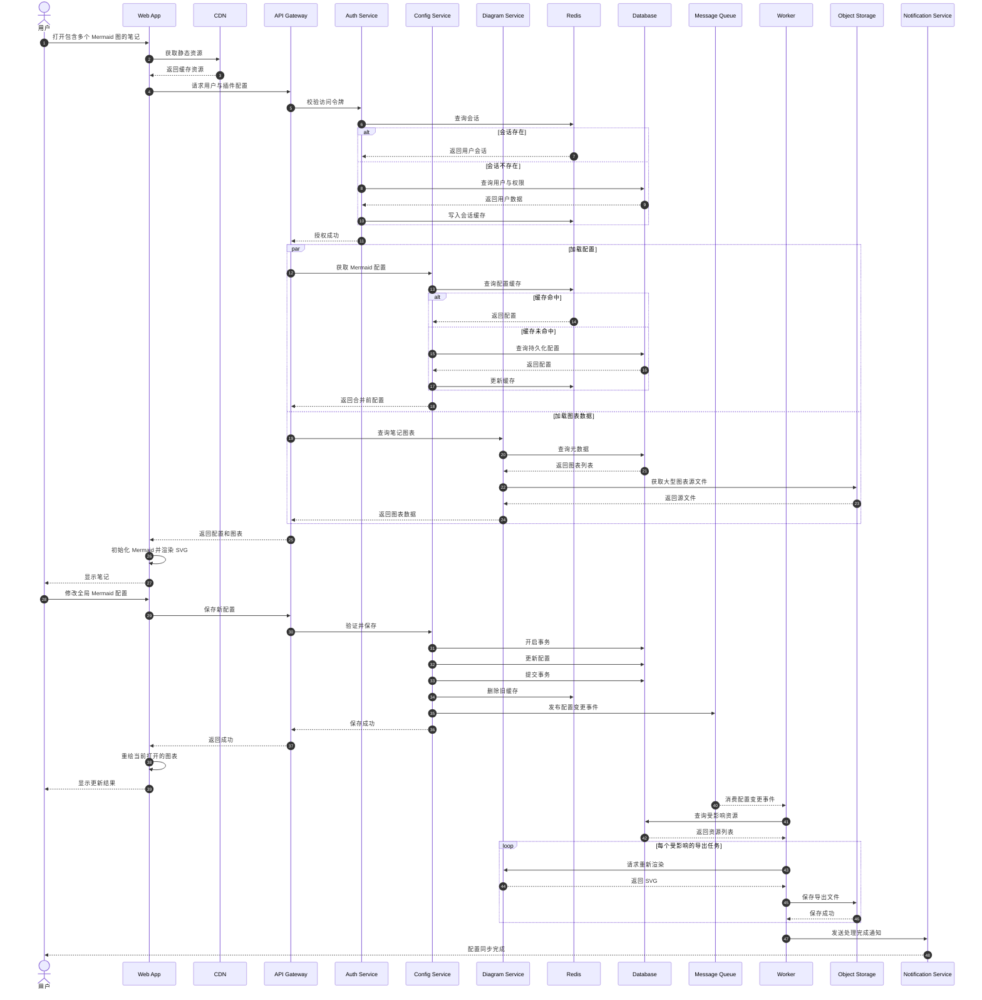
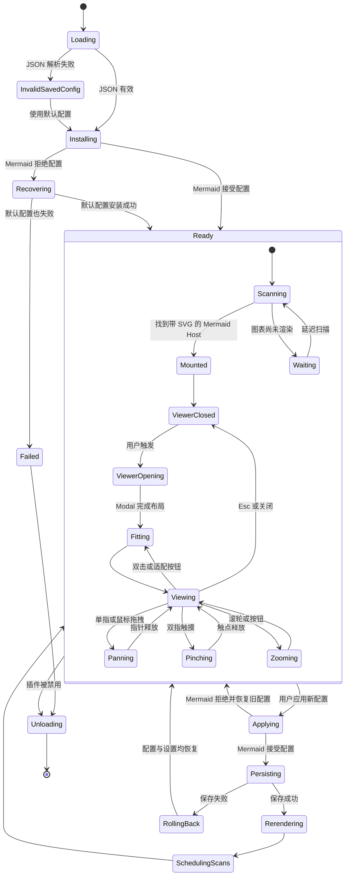

# 大型图表

这些图表刻意超过普通笔记宽度，用于检查初次适配、深度缩放、长距离平移和大型 SVG 的性能。

## 大型系统拓扑

```mermaid
flowchart LR
    subgraph Clients[客户端层]
        Web[Web App]
        Desktop[Desktop App]
        Mobile[Mobile App]
        CLI[Command Line]
        Partner[Partner API]
    end

    subgraph Edge[边缘与入口层]
        DNS[DNS]
        CDN[CDN]
        WAF[Web Application Firewall]
        LB[Load Balancer]
        Gateway[API Gateway]
        AuthProxy[Auth Proxy]
    end

    subgraph Services[业务服务层]
        Auth[Auth Service]
        User[User Service]
        Diagram[Diagram Service]
        Config[Config Service]
        Search[Search Service]
        Export[Export Service]
        Notify[Notification Service]
        Audit[Audit Service]
        Billing[Billing Service]
        Worker[Background Worker]
    end

    subgraph Data[数据层]
        MainDB[(Primary Database)]
        Replica[(Read Replica)]
        Redis[(Redis Cluster)]
        SearchDB[(Search Index)]
        Object[(Object Storage)]
        Queue[[Message Queue]]
        Secrets[(Secrets Store)]
    end

    subgraph Observability[可观测性]
        Collector[Telemetry Collector]
        Metrics[(Metrics)]
        Logs[(Logs)]
        Traces[(Traces)]
        Dashboard[Dashboard]
        Alerts[Alert Manager]
    end

    Web --> DNS
    Desktop --> DNS
    Mobile --> DNS
    CLI --> DNS
    Partner --> DNS
    DNS --> CDN --> WAF --> LB --> Gateway
    Gateway --> AuthProxy
    AuthProxy --> Auth
    Gateway --> User
    Gateway --> Diagram
    Gateway --> Config
    Gateway --> Search
    Gateway --> Export
    Gateway --> Billing

    Auth --> Secrets
    Auth --> Redis
    User --> MainDB
    User --> Redis
    Diagram --> MainDB
    Diagram --> Object
    Config --> MainDB
    Config --> Redis
    Search --> SearchDB
    Search --> Replica
    Export --> Object
    Export --> Queue
    Billing --> MainDB
    Billing --> Queue
    Queue --> Worker
    Worker --> Notify
    Worker --> Audit
    Worker --> Object
    MainDB --> Replica

    Auth -. telemetry .-> Collector
    User -. telemetry .-> Collector
    Diagram -. telemetry .-> Collector
    Config -. telemetry .-> Collector
    Search -. telemetry .-> Collector
    Export -. telemetry .-> Collector
    Worker -. telemetry .-> Collector
    Collector --> Metrics
    Collector --> Logs
    Collector --> Traces
    Metrics --> Dashboard
    Logs --> Dashboard
    Traces --> Dashboard
    Metrics --> Alerts
    Alerts --> Notify
```

## 完整请求与异步处理时序

```mermaid
sequenceDiagram
    autonumber
    actor User as 用户
    participant Web as Web App
    participant CDN
    participant Gateway as API Gateway
    participant Auth as Auth Service
    participant Config as Config Service
    participant Diagram as Diagram Service
    participant Cache as Redis
    participant DB as Database
    participant Queue as Message Queue
    participant Worker
    participant Store as Object Storage
    participant Notify as Notification Service

    User->>Web: 打开包含多个 Mermaid 图的笔记
    Web->>CDN: 获取静态资源
    CDN-->>Web: 返回缓存资源
    Web->>Gateway: 请求用户与插件配置
    Gateway->>Auth: 校验访问令牌
    Auth->>Cache: 查询会话
    alt 会话存在
        Cache-->>Auth: 返回用户会话
    else 会话不存在
        Auth->>DB: 查询用户与权限
        DB-->>Auth: 返回用户数据
        Auth->>Cache: 写入会话缓存
    end
    Auth-->>Gateway: 授权成功

    par 加载配置
        Gateway->>Config: 获取 Mermaid 配置
        Config->>Cache: 查询配置缓存
        alt 缓存命中
            Cache-->>Config: 返回配置
        else 缓存未命中
            Config->>DB: 查询持久化配置
            DB-->>Config: 返回配置
            Config->>Cache: 更新缓存
        end
        Config-->>Gateway: 返回合并前配置
    and 加载图表数据
        Gateway->>Diagram: 查询笔记图表
        Diagram->>DB: 查询元数据
        DB-->>Diagram: 返回图表列表
        Diagram->>Store: 获取大型图表源文件
        Store-->>Diagram: 返回源文件
        Diagram-->>Gateway: 返回图表数据
    end

    Gateway-->>Web: 返回配置和图表
    Web->>Web: 初始化 Mermaid 并渲染 SVG
    Web-->>User: 显示笔记

    User->>Web: 修改全局 Mermaid 配置
    Web->>Gateway: 保存新配置
    Gateway->>Config: 验证并保存
    Config->>DB: 开启事务
    Config->>DB: 更新配置
    Config->>DB: 提交事务
    Config->>Cache: 删除旧缓存
    Config->>Queue: 发布配置变更事件
    Config-->>Gateway: 保存成功
    Gateway-->>Web: 返回成功
    Web->>Web: 重绘当前打开的图表
    Web-->>User: 显示更新结果

    Queue-->>Worker: 消费配置变更事件
    Worker->>DB: 查询受影响资源
    DB-->>Worker: 返回资源列表
    loop 每个受影响的导出任务
        Worker->>Diagram: 请求重新渲染
        Diagram-->>Worker: 返回 SVG
        Worker->>Store: 保存导出文件
        Store-->>Worker: 保存成功
    end
    Worker->>Notify: 发送处理完成通知
    Notify-->>User: 配置同步完成
```

## 大型状态机

```mermaid
stateDiagram-v2
    [*] --> Loading
    Loading --> InvalidSavedConfig: JSON 解析失败
    Loading --> Installing: JSON 有效
    InvalidSavedConfig --> Installing: 使用默认配置
    Installing --> Ready: Mermaid 接受配置
    Installing --> Recovering: Mermaid 拒绝配置
    Recovering --> Ready: 默认配置安装成功
    Recovering --> Failed: 默认配置也失败

    state Ready {
        [*] --> Scanning
        Scanning --> Mounted: 找到带 SVG 的 Mermaid Host
        Scanning --> Waiting: 图表尚未渲染
        Waiting --> Scanning: 延迟扫描
        Mounted --> ViewerClosed
        ViewerClosed --> ViewerOpening: 用户触发
        ViewerOpening --> Fitting: Modal 完成布局
        Fitting --> Viewing
        Viewing --> Panning: 单指或鼠标拖拽
        Panning --> Viewing: 指针释放
        Viewing --> Pinching: 双指触摸
        Pinching --> Viewing: 触点释放
        Viewing --> Zooming: 滚轮或按钮
        Zooming --> Viewing
        Viewing --> Fitting: 双击或适配按钮
        Viewing --> ViewerClosed: Esc 或关闭
    }

    Ready --> Applying: 用户应用新配置
    Applying --> Persisting: Mermaid 接受配置
    Applying --> Ready: Mermaid 拒绝并恢复旧配置
    Persisting --> Rerendering: 保存成功
    Persisting --> RollingBack: 保存失败
    RollingBack --> Ready: 配置与设置均恢复
    Rerendering --> SchedulingScans
    SchedulingScans --> Ready
    Ready --> Unloading: 插件被禁用
    Failed --> Unloading
    Unloading --> [*]
```
